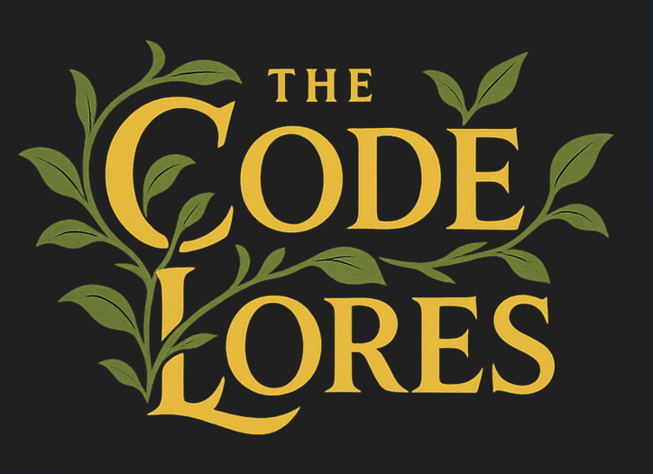

  

# 🚀 The CodeLores – Tech Comics

**The CodeLores** is a comic series blending coding, humor, and storytelling.  
Instead of dry docs, we explain coding, debugging, and developer life through **fun comic strips**.

---

## 📖 Comics
- [000 – Intro to Codelores](comics/000-intro)
- [001 – Reverse Integer](comics/001-reverse-integer)
- 002 – Coming soon…

---

## 📚 What You'll Find
- 🎨 Comics (PNG/JPG format)  
- 📝 Notes & extended editions  
- 💡 Community contributions  

---

## 🤝 Contribute
Got a funny dev story or coding struggle?  
👉 See our [Contributing Guidelines](CONTRIBUTING.md).

---

## 📜 License
All comics are under **CC BY-NC 4.0** — free to share & remix with credit, but not for commercial use.

---

🔗 Follow on [LinkedIn](https://www.linkedin.com/in/aisha-karigar/)  
Hashtag: **#TheCodeLores**
