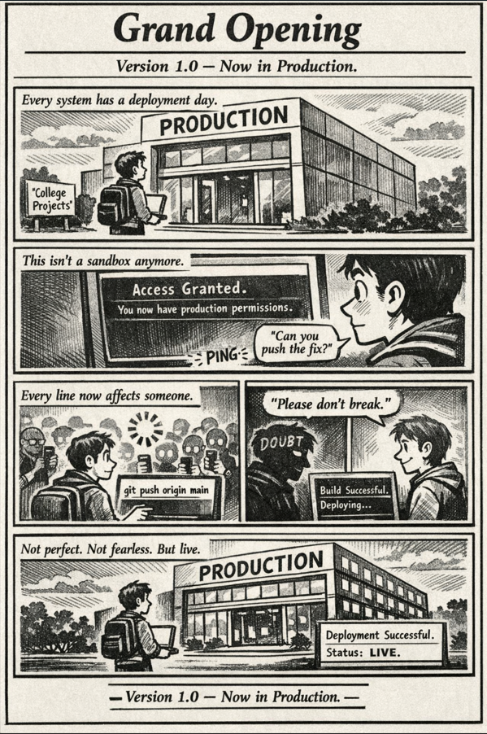

*Version 1.0 — Now in Production 🚀*
 

---

## 🧩 The Moment  

There’s a strange shift that happens in every engineer’s life.

One day, you’re building:
- College assignments  
- Side projects  
- Safe sandbox experiments  

The next day…

You’re staring at a terminal that says:

`Access Granted. Production permissions enabled.`

And suddenly, it’s real.

This isn’t practice anymore.  
This is live.

---

## 🖥 The Code That Feels Different  

On the surface, it’s just a push.

```bash
git add .
git commit -m "Fix production bug"
git push origin main
````

But this time, that `push` means:

* Real users
* Real traffic
* Real consequences

That ENTER key?
It’s a ribbon-cutting ceremony.

---

## 🌍 Real-World Connection

Internship Day 1 feels like walking into a building labeled:

**PRODUCTION**

And behind that door:

* Systems serving thousands (or millions)
* Monitoring dashboards blinking in real time
* Senior engineers reviewing your commits
* Slack notifications that don’t wait

Unlike college projects:

* You can’t restart reality.
* You can’t ignore users.
* You can’t say “It works on my machine.”

Production doesn’t care about intention.
It cares about reliability.

---

## 🛠 What Changes in the Real World

The difference between “student mode” and “production mode” isn’t syntax.

It’s mindset.

* **Ownership**
  Your code doesn’t end at submission. It lives, runs, and impacts people.

* **Observability**
  Logs, metrics, alerts — systems speak back.

* **Collaboration**
  Code reviews aren’t criticism. They’re quality control.

* **Failure Handling**
  Bugs aren’t embarrassing — hiding them is.

* **Incremental Growth**
  You don’t ship perfection.
  You ship improvement.

---

## ⚡ The Real Grand Opening

When you press deploy for the first time, you think:

“Please don’t break.”

But what actually happens is bigger.

You don’t just deploy code.

You deploy:

* Responsibility
* Confidence
* Resilience
* A new version of yourself

This is Version 1.0.

Not flawless.
Not fearless.
But live.

---

## 🎬 Takeaway

Every engineer has a “Grand Opening.”

Not of a product.

Of their career.

And once you’re in production,
there’s no going back to sandbox mode.

---

🔙 [Back to TheCodeLores Home](../../index.md)

📅 Published: March 2026
✍️ Author: [Aisha Karigar](https://github.com/aishakarigar)
