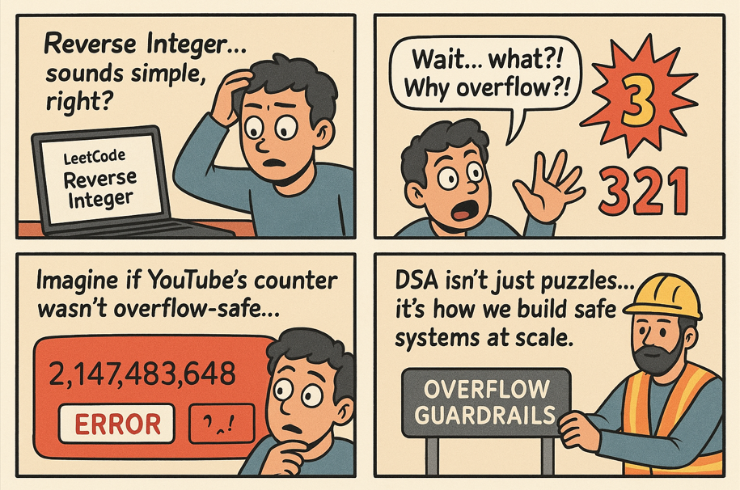

# Comic 001 – Reverse Integer  


 

---

## 🧩 Problem  
On LeetCode, “Reverse Integer” looks simple:  
👉 Take an integer, flip its digits, return the result.  

But here’s the catch: what if the reversed number overflows a 32-bit integer?  
💥 Suddenly, your program crashes.  

---

## 💻 Code Example (C++)  

```cpp
#include <iostream>
#include <climits> // for INT_MAX and INT_MIN
using namespace std;

class Solution {
public:
    int reverse(int x) {
        int rev = 0;
        while (x != 0) {
            int digit = x % 10;
            x /= 10;

            // Check for overflow before multiplying by 10
            if (rev > INT_MAX / 10 || (rev == INT_MAX / 10 && digit > 7)) {
                return 0; // overflow
            }
            if (rev < INT_MIN / 10 || (rev == INT_MIN / 10 && digit < -8)) {
                return 0; // underflow
            }

            rev = rev * 10 + digit;
        }
        return rev;
    }
};

int main() {
    Solution s;
    cout << s.reverse(123) << endl;   // Output: 321
    cout << s.reverse(-123) << endl;  // Output: -321
    cout << s.reverse(120) << endl;   // Output: 21
    cout << s.reverse(1534236469) << endl; // Output: 0 (overflow)
    return 0;
}

```

---

## 🌍 Real-World Connection

Think of YouTube’s view counter.
Every time a video racks up millions of views, the counter increments.

But if the system isn’t **overflow-safe**…
➡️ 2 billion views could turn into negative views or break the counter.

This tiny puzzle reflects a massive engineering challenge:
✔ Handling edge cases at scale
✔ Designing systems that fail gracefully
✔ Thinking like an engineer, not just a coder

---

## ⚡ Takeaway

DSA isn’t just about algorithms.
It’s about building systems that stand strong in the real world.

👉 Next time you solve a DSA problem, ask:
**“Where does this live in the real world?”**

---

🔙 [Back to TheCodeLores Home](../../README.md)

📅 Published: September 2025
✍️ Author: [Aisha Karigar](https://github.com/aishakarigar)


