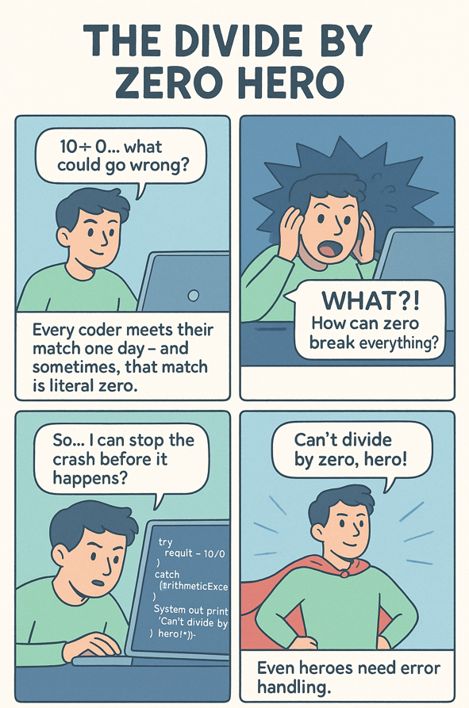

*Some divide to conquer. Others… just crash.*

---

## 💥 Problem  
Every developer meets their match one day —  
and sometimes, that match is literally *zero*.

Division seems harmless... until you divide by zero and the entire program detonates with a `ZeroDivisionError` or `ArithmeticException`.

---

## 💻 Code Example (Java)

```java
public class DivideByZeroHero {
    public static void main(String[] args) {
        try {
            int result = 10 / 0;
        } catch (ArithmeticException e) {
            System.out.println("Can't divide by zero, hero!");
        }
    }
}
````

---

## 💻 Code Example (Python)

```python
try:
    result = 10 / 0
except ZeroDivisionError:
    print("Can't divide by zero, hero!")
```

---

## 🧩 Lesson

When a program attempts to divide by zero, it triggers a **runtime exception** —
an error that occurs *while the code is running*.

To prevent a crash, we use **exception handling**:

* `try–catch` in Java / C++
* `try–except` in Python

This lets the program recover gracefully instead of crashing mid-run.

---

## 🌍 Real-World Connection

Runtime exceptions are like real-life failures — inevitable, but manageable.

Systems that power banking apps, autopilots, or even spacecraft use **exception handling** to:

* Detect unexpected conditions
* Log and contain the failure
* Keep the rest of the system running safely

Even superheroes need backup plans — and so does your code. ⚡

---

## 🦸 CodeLore

Our hero thought dividing would make things easier —
but zero had other plans.

When your program crashes faster than your Wi-Fi, remember:
**Even heroes need error handling.**

---

🔙 [Back to TheCodeLores Home](../../index.md)

📅 Published: October 2025
✍️ Author: [Aisha Karigar](https://github.com/aishakarigar)


