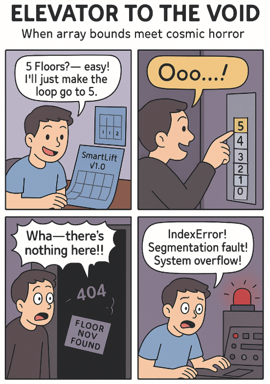

*When “just one more iteration” means the end of the world…* 🌍💀

---

## 💥 Problem  
Every developer’s first nemesis:  
the **off-by-one error** — a tiny mistake that causes *epic chaos*.

It happens when your loop runs **one time too many** (or too few),  
often because of a small typo in the loop boundary —  
like writing `<= n` instead of `< n`.

The result? Your program steps outside the intended range,  
accessing memory that doesn’t belong to it.  
And just like that, your perfect logic meets its apocalypse.

---

## 💻 Code Example (C++)

```cpp
#include <iostream>
using namespace std;

int main() {
    int n = 5;
    int clones[5];

    for (int i = 0; i <= n; i++) {  // ⚠️ Off-by-one error!
        clones[i] = i;
        cout << "Clone #" << i << " created\n";
    }

    return 0;
}
💻 Code Example (Python)
python
Copy code
clones = [0] * 5

for i in range(0, 6):  # ⚠️ Off-by-one error! range(0, 6) → runs 6 times
    clones[i] = i
    print(f"Clone #{i} created")
🧩 Lesson
The difference between < n and <= n decides whether you:
✅ stay within bounds — or
❌ summon an IndexError / Segmentation Fault.

If your array has n elements, valid indices are 0 through n-1.
So use i < n, not i <= n.

Rule of thumb:
👉 Arrays are zero-indexed. Loops should stop before n.

Think of it as an exclusive party — n is on the guest list,
but never gets inside. 🎟️

🌍 Real-World Connection
Off-by-one errors are everywhere — in loops, slicing,
pagination, and even in time calculations.

NASA’s Mars Climate Orbiter once failed
due to a unit conversion bug —
a tiny mismatch that led to massive consequences.
One extra or missing iteration can cause similar chaos
in software systems managing memory, arrays, or buffers.

Precision isn’t just math — it’s survival. 🚀

🦸 CodeLore
Our hero’s clone army was supposed to have n soldiers —
but i <= n unleashed one too many.
The overflow began… and so did the apocalypse.

“For i = 0; i <= n; i++ —
and just like that, the world had one extra day.”

🔙 Back to TheCodeLores Home

📅 Published: November 2025
✍️ Author: Aisha Karigar
