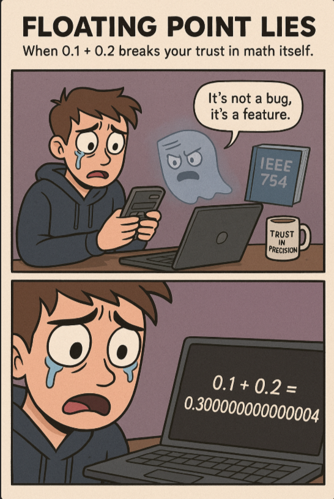

*When `0.1 + 0.2` breaks your trust in math itself.* 🤯

---

## 💥 Problem  

You’d think **0.1 + 0.2 = 0.3**, right?  
But computers think otherwise.  
They’ll tell you:  
> `0.1 + 0.2 = 0.30000000000000004`

Somewhere between binary math and digital logic,  
**trust issues develop.** 😭

---

## 💻 Code Example (Python)

```python
>>> 0.1 + 0.2
0.30000000000000004
````

Why? Because computers don’t store numbers in decimal.
They use **binary fractions**, and some numbers like 0.1 or 0.2
can’t be represented exactly in binary.

So what you get is an *approximation* —
a heartbreak hidden behind fifteen extra zeros.

---

## 💻 Code Example (C++)

```cpp
#include <iostream>
using namespace std;

int main() {
    double a = 0.1;
    double b = 0.2;
    double c = a + b;

    cout.precision(17);
    cout << "0.1 + 0.2 = " << c << endl;

    return 0;
}
```

**Output:**

```
0.1 + 0.2 = 0.30000000000000004
```

Even C++ can’t escape the floating-point truth —
it’s not a bug, it’s *binary logic.*

---

## 🧠 What’s Actually Happening

Floating-point numbers follow the **IEEE 754 standard**,
which represents values as:

```
(-1)^sign × 1.mantissa × 2^(exponent - bias)
```

In binary, `0.1` becomes a **repeating fraction**,
just like 1/3 in decimal (0.3333...).

When your CPU tries to store it,
it rounds it to the nearest representable binary value.
Add two of these “almost-accurate” numbers,
and the rounding errors show up like ghosts in your output.

---

## 🧩 Lesson

Floating-point math isn’t wrong — it’s just **imprecise**.
So when accuracy matters (like in finance, physics, or pixel-perfect graphics):

✅ Use `Decimal` or `Fraction` modules (Python)
✅ Round results explicitly with `round(x, n)`
✅ Never compare floats directly — compare their difference (`abs(a - b) < ε`)

**Rule of thumb:**
Trust integers. Doubt floats. Always verify decimals.

---

## 🌍 Real-World Connection

* Your favorite game’s weird physics? → Float precision.
* Rounding mismatches in billing systems? → Float precision.
* Machine learning gradient vanishing/exploding issues? → Yep, float precision again.

Even NASA’s software teams learned to *never* take decimal math for granted.

---

## 🦸 CodeLore

Our dev sat down for a simple sum.
But when the calculator betrayed them,
they whispered to the screen:

> “I gave you my precision,
> and you gave me... 0.30000000000000004.”

---

🔙 [Back to TheCodeLores Home](../../index.md)

📅 Published: November 2025
✍️ Author: [Aisha Karigar](https://github.com/aishakarigar)

