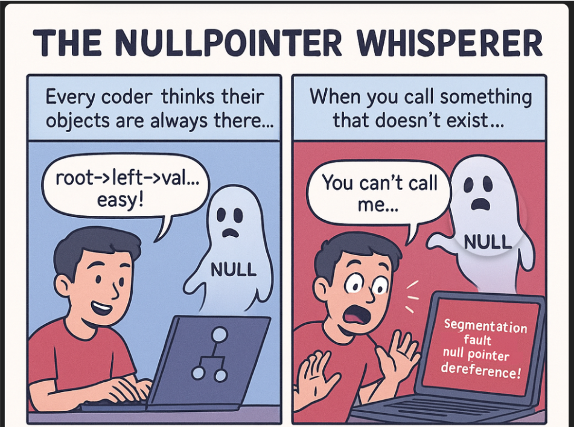

*“You can’t call them… they’re null to you.” 👻📞*
 
---

## 🧩 Problem  
Everything works fine in your code…  
until *that one pointer* you thought existed  
turns out to be **`NULL`**.

A harmless access like:  
```cpp
root->left->val
````

suddenly becomes
💥 **Segmentation fault (null pointer dereference).**
The silent killer of C++ beginners.

---

## 💻 Code Example (C++ with Binary Tree)

```cpp
#include <iostream>
using namespace std;

struct Node {
    int val;
    Node* left;
    Node* right;

    Node(int v) : val(v), left(nullptr), right(nullptr) {}
};

int getLeftValue(Node* root) {
    // ❌ This will crash if root or root->left is NULL
    return root->left->val;
}

int safeGetLeftValue(Node* root) {
    // ⭐ Safe null checks
    if (root == nullptr) {
        cout << "Root is null!" << endl;
        return -1;
    }
    if (root->left == nullptr) {
        cout << "Left child is null!" << endl;
        return -1;
    }
    return root->left->val;
}

int main() {
    Node* root = new Node(10);

    // Left child not created → NULL
    cout << getLeftValue(root) << endl;
    // 💥 Segmentation fault (null pointer dereference)

    // Fix:
    root->left = new Node(20);
    cout << safeGetLeftValue(root) << endl; // ✔ Prints 20

    return 0;
}
```

### Why this crashes

`root->left->val` tries to access `.val` on a `nullptr`.

It’s like trying to call someone whose phone is off:
📞 "Dialing left child…"
👻 Nobody is there to pick up — they’re **null to you.**

---

## 🌍 Real-World Connection

Null pointers aren’t just classroom errors.
They break:

* Tree traversals in compilers
* Graph searches in game engines
* Database connection layers
* Microservices returning empty responses
* OS kernels handling missing resources

A single unexpected `NULL` can take down an entire application.

---

## 🛠 How It’s Solved in the Real World

* **Smart pointers (`unique_ptr`, `shared_ptr`)**
  Avoid raw pointers and get automatic lifetime management.

* **Defensive programming**
  Check before you dereference. Always.

* **Optional types**
  `std::optional<T>` in modern C++ helps you avoid “maybe-null” designs.

* **Fail fast & log**
  Production systems detect and trace null accesses early.

* **Safer languages**
  Rust, Kotlin, Swift, and TypeScript use strict null safety at the compiler level.

---

## ⚡ Takeaway

A null pointer isn’t an error —
it’s a reminder to respect object lifecycles
and code defensively.

👉 Next time you dereference a pointer, ask:
**“Am I sure this exists?”**

---

🔙 [Back to TheCodeLores Home](../../index.md)

📅 Published: November 2025
✍️ Author: [Aisha Karigar](https://github.com/aishakarigar)
