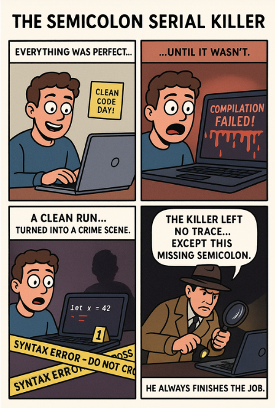

*“He always finishes the job.” 🔪;*

---

## 🧩 Problem  
Your code looks clean…  
your logic looks perfect…  
your confidence is high…

…until one tiny, invisible assassin  
—a **missing semicolon**—  
turns your program into a crime scene.

A harmless line like:

```js
let x = 42
````

becomes the weapon of chaos.

💥 **Compilation failed (unexpected token).**

One character.
One omission.
Infinite debugging pain.

---

## 💻 Code Example 1 — JavaScript

```js
function add(a, b) {
    return a + b   // ❌ Missing semicolon
}

function safeAdd(a, b) {
    return a + b;  // ✔ Semicolon in place
}

console.log(add(3, 5));  
// In strict builds, bundlers, or minifiers → 💥 SyntaxError

console.log(safeAdd(3, 5));
// ✔ Works perfectly
```

### Why this breaks

Without the semicolon, JavaScript's **Automatic Semicolon Insertion (ASI)**
tries to guess where semicolons belong.

Sometimes it guesses right.
Sometimes it ruins your whole build.

---

## 💻 Code Example 2 — C++ Version

In C++, the rules are unforgiving.
Miss a semicolon, and your compiler *immediately* draws the yellow crime tape.

```cpp
#include <iostream>
using namespace std;

int add(int a, int b) {
    return a + b  // ❌ Missing semicolon → compilation error
}

int safeAdd(int a, int b) {
    return a + b; // ✔ Correct
}

int main() {
    cout << add(3, 5) << endl;
    cout << safeAdd(3, 5) << endl;

    return 0;
}
```

### Typical C++ error:

```
error: expected ‘;’ after return statement
```

C++ doesn’t *guess* like JavaScript —
it simply refuses to run your code until every semicolon is in place.

---

## 🌍 Real-World Connection

Missing semicolons have caused failures in:

* Minified JavaScript bundles
* TypeScript transpiled code
* C++ build pipelines with thousands of files
* Embedded systems where one error halts the entire compile
* Financial systems using C++ for low-latency trading
* CI/CD deploy blocking due to strict style/lint checks

A single forgotten `;` can block an entire release.

---

## 🛠 How Developers Prevent This

* **Linters (eslint, prettier)** — Auto-enforce semicolon style
* **C++ compiler warnings** — Detect missing punctuation early
* **Formatting on save** — Editor inserts required semicolons
* **Consistent style guides** — Every team member writes the same way
* **Strong CI rules** — No build passes with inconsistent syntax

---

## ⚡ Takeaway

A missing semicolon is small…
but the bug it creates is **not**.

It’s the software equivalent of leaving a door unlocked
for a serial killer to walk in. 🏚️🔪

👉 Always check your line endings.
Because as the detective says:

**“The killer left no trace… except this missing semicolon.”**

---

🔙 [Back to TheCodeLores Home](../../index.md)

📅 Published: November 2025
✍️ Author: [Aisha Karigar](https://github.com/aishakarigar)


Just tell me!
```
