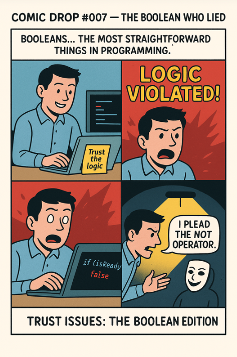

*Trust issues: the Boolean edition 😵🔀*

---

## 🧩 Problem

Booleans are supposed to be the **most trustworthy** things in programming:
👉 `true` means TRUE
👉 `false` means FALSE
No drama. No confusion. No loopholes.

But then one day…
Your carefully crafted logic suddenly screams:
**“LOGIC VIOLATED!”** 🔥

Your `true` behaves like `false`.
Your `false` behaves like `true`.
And you’re left interrogating your code like a detective in a crime thriller.

Welcome to…
**The Boolean Who Lied.**

---

## 💻 Code Example (C++)

```cpp
#include <iostream>
using namespace std;

bool trustIssue(bool val) {
    // Our Boolean is lying on purpose
    return !val; // The NOT operator — the perfect alibi
}

int main() {
    bool a = true;
    bool b = false;

    cout << "Original TRUE becomes: " << trustIssue(a) << endl;  // 0 (FALSE)
    cout << "Original FALSE becomes: " << trustIssue(b) << endl; // 1 (TRUE)

    if (trustIssue(true)) {
        cout << "Logic violated! This shouldn't run... but it does. 😐" << endl;
    }

    return 0;
}
```

---

## 🌍 Real-World Connection

A Boolean flipping unexpectedly is more than a quirky bug —
it’s **a logical betrayal**.

In real systems, this can happen due to:

* ❌ Uninitialized or garbage memory
* ❌ Corrupted flags
* ❌ Race conditions
* ❌ Negated logic (`!isReady` vs `isNotReady`)
* ❌ Faulty sensor readings
* ❌ Distributed systems where “truth” arrives late

One wrong truth value can trigger chaos:

* Running unsafe code paths
* Allowing unauthorized access
* Skipping validations
* Triggering alarms unnecessarily
* Breaking entire workflows

It’s the classic situation where your code says one thing…
but reality says another.

---

## 🛠 How Engineers Prevent Boolean Betrayals

* **Always initialize flags**
  Uninitialized booleans = unpredictable truth.

* **Use meaningful names**
  Avoid nightmares like `!isNotReady`.

* **Assert invariants**
  If a Boolean enters an impossible state → alert immediately.

* **Log unexpected flips**
  When your Boolean “pleads the NOT operator,” you’ll know.

* **Reduce NOT overload**
  Too many `!` signs create Boolean spaghetti and hidden lies.

---

## ⚡ Takeaway

A Boolean only has two states…
But if it lies even once, your entire program collapses like a house of cards.

So the next time you debug a strange behavior, don’t just check the logic.
Check the *liar* hiding behind the logic.

Because in programming…
**even Booleans can have trust issues.** 😭🔁

---

🔙 [Back to TheCodeLores Home](../../index.md)

📅 Published: September 2025
✍️ Author: [Aisha Karigar](https://github.com/aishakarigar)
