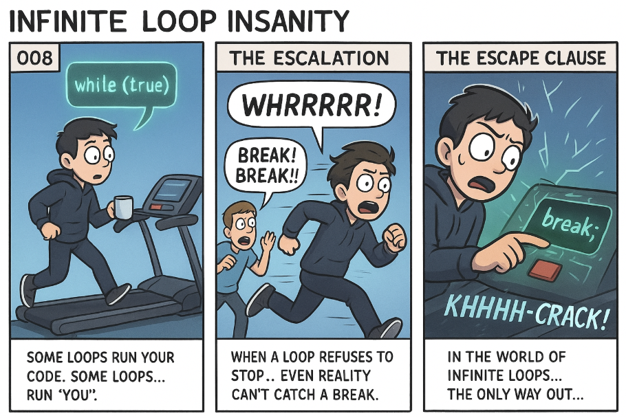

*Some loops run your code. Some loops… run **you**.* 🏃‍♂️💨

---

## 🧩 Problem  
Infinite loops look innocent at first:

```cpp
while (true) {
    // do something
}
````

But one missing exit condition…
One forgotten `break`…
💥
…and suddenly your program — or *you* — is running forever.

In real systems, infinite loops can freeze UIs, consume CPUs, stall servers, or take entire microservices down.

---

## 💻 Code Example (C++)

```cpp
#include <iostream>
using namespace std;

int main() {
    int counter = 0;

    while (true) {
        cout << "Loop iteration: " << counter << endl;
        counter++;

        // Escape condition to avoid infinite loop
        if (counter == 5) {
            break;
        }
    }

    cout << "Loop exited successfully!" << endl;
    return 0;
}
```

---

## 🌍 Real-World Connection

Infinite loops aren’t just rookie mistakes — they appear everywhere:

* **Frontend:** A broken state update keeps re-rendering a UI.
* **Backend:** A `while(true)` server worker hangs because a network response never arrives.
* **IoT systems:** Sensors lock the whole device in a high-power loop.
* **Game engines:** AI logic loops tank the FPS to zero.

Worst-case scenario?
➡️ They max out your CPU and freeze the entire system.

Like the treadmill in the comic, the system keeps running…
even when **you** can’t.

---

## 🛠 How Engineers Prevent Infinite Loops

To escape the “treadmill” in real-world systems:

### ✔️ **Timeouts**

Stop the loop if an operation takes too long.

### ✔️ **Break Conditions**

Always ensure a logical exit path.

### ✔️ **Watchdogs (common in embedded systems)**

If a loop stalls, an external monitor restarts the system.

### ✔️ **Fail-Safes**

“Should never happen” conditions must still have a fallback.

### ✔️ **Resource Monitoring**

Terminate loops that exceed CPU/memory limits.

Infinite loops aren’t just bugs —
they’re architecture failures waiting to happen.

---

## ⚡ Takeaway

Every loop needs a way out.

Because in computing — and in life —
**a missing break can trap everything.**

---

🔙 [Back to TheCodeLores Home](../../index.md)

📅 Published: December 2025
✍️ Author: [Aisha Karigar](https://github.com/aishakarigar)
