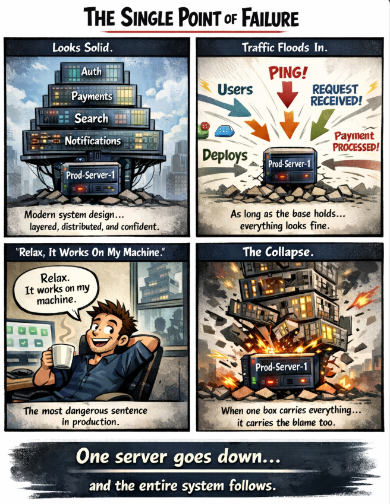

 


*When your entire system stands on one shaky box 🧱💥*
 

---

## 🧩 Problem  
In system design, everything can look perfect on paper:  
👉 Clean architecture  
👉 Multiple services  
👉 Green dashboards  

But there’s one silent killer hiding underneath:  
**a Single Point of Failure (SPOF)**.

If one component goes down and the entire system collapses…  
you didn’t build a distributed system —  
you built a **fragile one**.

---

## 💻 Code Example (Conceptual – Single Server)

```cpp
// A simplified representation of a single-server backend

Server prodServer("Prod-Server-1");

int main() {
    while (true) {
        Request req = receiveRequest();
        prodServer.handle(req); // everything goes here
    }
}
````

Looks simple.
Works locally.
Works in testing.

Until **Prod-Server-1** goes down.

---

## 🌍 Real-World Connection

Imagine an e-commerce platform:

* User login
* Product search
* Payments
* Notifications

All routed through **one backend server**.

As traffic grows:

* CPU spikes
* Memory fills
* Latency increases

Then one bad deploy…
💥 **The server crashes**

Result:

* No logins
* No payments
* No orders
* No revenue

The business doesn’t degrade —
it **stops**.

---

## 🛠 How It’s Solved in the Real World

Real production systems are designed to **assume failure**, not avoid it.

* **Redundancy**
  Never rely on one instance.
  Use multiple servers running the same service.

* **Load Balancers**
  Incoming traffic is distributed across healthy servers.
  If one fails, traffic is rerouted automatically.

* **Replication**
  Databases are replicated across nodes.
  If the primary goes down, a replica takes over.

* **Health Checks & Auto-Healing**
  Systems constantly check server health.
  Failed instances are removed and replaced automatically.

* **Failover Strategies**
  Critical services have backups ready to take control within seconds.

In short:

> Production systems are built to survive failure — not pretend it won’t happen.

---

## ⚡ Takeaway

System design isn’t about making things work.
It’s about making sure they **keep working when things break**.

👉 If one server can take down your system,
you don’t have high availability —
you have **false confidence**.

---

🔙 [Back to TheCodeLores Home](../../index.md)

📅 Published: September 2025
✍️ Author: [Aisha Karigar](https://github.com/aishakarigar)
