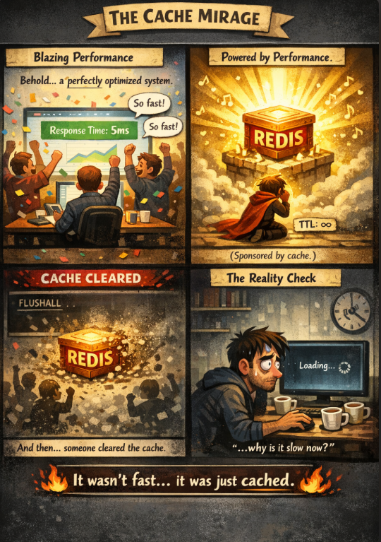

 



*When your “fast system” forgets who it really is.* ⚡🫥
 

---

## 🧩 Problem  
Your application feels **blazing fast**:  
👉 Pages load instantly  
👉 APIs respond in milliseconds  
👉 Users are happy  

But there’s a hidden truth.

The performance isn’t coming from efficient logic or scalable design —  
it’s coming from **cache**.

And the moment that cache disappears…  
💥 reality hits.

---

## 💻 Code Example (Cache-Dependent API)

```cpp
// Pseudo C++ example of cache-first logic

string getUserProfile(int userId) {
    // Step 1: Check cache
    if (redis.exists(userId)) {
        return redis.get(userId); // ⚡ FAST
    }

    // Step 2: Fallback to database
    string profile = database.queryUser(userId); // 🐌 SLOW

    // Step 3: Store back in cache
    redis.set(userId, profile);

    return profile;
}
````

This works beautifully…
**until the cache is cleared.**

---

## 🌍 Real-World Connection

Imagine an e-commerce site during a flash sale:

* Product listings are cached
* Prices are cached
* Recommendations are cached

Everything feels instant.

Now picture this happening at peak traffic:

```
redis-cli FLUSHALL
```

Suddenly:

* Database CPU spikes 📈
* Requests pile up
* Latency explodes
* Users start refreshing… and leaving

The system wasn’t *fast* —
it was just **shielded**.

---

## 🛠 How It’s Handled in the Real World

Professional systems assume cache **will fail**.

Here’s how they survive:

* **Cache is an optimization, not a dependency**
  Business logic must still work — just slower — without cache.

* **Cache warming**
  Preloading frequently used data after restarts or deployments.

* **Graceful degradation**

  * Disable non-critical features
  * Serve partial data
  * Show fallback content instead of timing out

* **Rate limiting & circuit breakers**
  Prevent databases from being overwhelmed when cache misses spike.

* **Observability**
  Metrics like:

  * Cache hit ratio
  * Cold start latency
  * P95 / P99 response times

If those aren’t monitored — you’re flying blind.

---

## ⚡ Takeaway

Caching doesn’t make bad systems good.
It only **hides** their weaknesses.

👉 Real performance means:

* Efficient queries
* Scalable architecture
* Cache-aware design

Because one day…
**someone will clear the cache.**

---

🔙 [Back to TheCodeLores Home](../../index.md)

📅 Published: September 2025
✍️ Author: [Aisha Karigar](https://github.com/aishakarigar)
Just say the word 🚀
```
