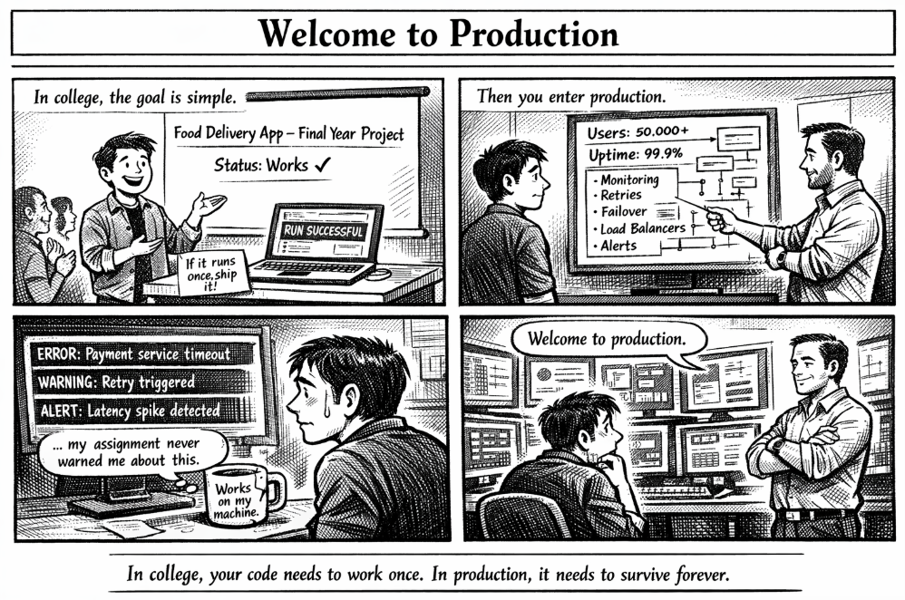

*When “works on my machine” meets 50,000 users.*

---

## 🧩 The Situation

In college, building software usually follows a simple rule:

👉 **If the code runs once, the assignment is done.**

You build the project, run it during the demo, the output appears…  
and that’s enough.

But internships introduce a completely different reality.

Your code is no longer written for **one demonstration**.  
It is written for **real users**, real traffic, and real consequences.

Suddenly the expectations change:

- The system must stay **online 24/7**
- Failures must be **detected automatically**
- Errors must be **logged and monitored**
- Systems must **recover when things break**

This is the moment many developers realize:

> **Software in production is not just code.  
> It is an ecosystem.**

---

## 💻 A Simple Example

A college program might look like this:

```cpp
#include <iostream>
using namespace std;

int main() {
    cout << "Food delivery service running..." << endl;
    return 0;
}
````

If the program runs and prints the message, the assignment is complete.

But a real service behind a food delivery platform might look more like this:

```python
def handle_request(request):
    try:
        response = process_order(request)
        log_event("order_success")
        return response
    except TimeoutError:
        log_event("service_timeout")
        retry_request(request)
    except Exception as e:
        log_error(e)
        alert_engineering_team()
```

Now the system is responsible for:

* handling failures
* logging errors
* retrying operations
* alerting engineers

Because **in production, failures are expected**.

---

## 🌍 Real-World Connection

Consider a typical **food delivery app**.

When thousands of users place orders at the same time, the backend system must handle:

* huge traffic spikes
* network delays
* payment service failures
* database slowdowns

To survive this, companies design systems with layers such as:

* **Load balancers** to distribute traffic
* **Monitoring dashboards** to track system health
* **Logging pipelines** to investigate failures
* **Alert systems** to notify engineers instantly

Without these safeguards, even a small bug could bring down the entire service.

---

## 🛠 How Production Systems Handle This

Real-world software is designed with **resilience in mind**.

### Monitoring

Engineers track metrics like:

* request latency
* error rates
* server health

This helps detect issues **before users notice them**.

---

### Logging

Every system action can be recorded.

Logs help answer questions like:

* Why did a request fail?
* When did the problem start?
* Which service caused it?

Without logs, debugging production issues becomes nearly impossible.

---

### Automatic Recovery

Instead of crashing when something fails, systems try to recover:

* retrying failed requests
* switching to backup services
* isolating faulty components

This allows platforms to maintain **high uptime**.

---

## ⚡ Takeaway

The biggest difference between **college coding** and **production engineering** isn’t syntax or frameworks.

It’s mindset.

In college we ask:

> **“Does the program run?”**

In production we ask:

> **“Will the system survive?”**

That shift in thinking is what turns a programmer into an engineer.

---

🔙 [Back to TheCodeLores Home](../../index.md)

📅 Published: March 2026
✍️ Author: [Aisha Karigar](https://github.com/aishakarigar)
