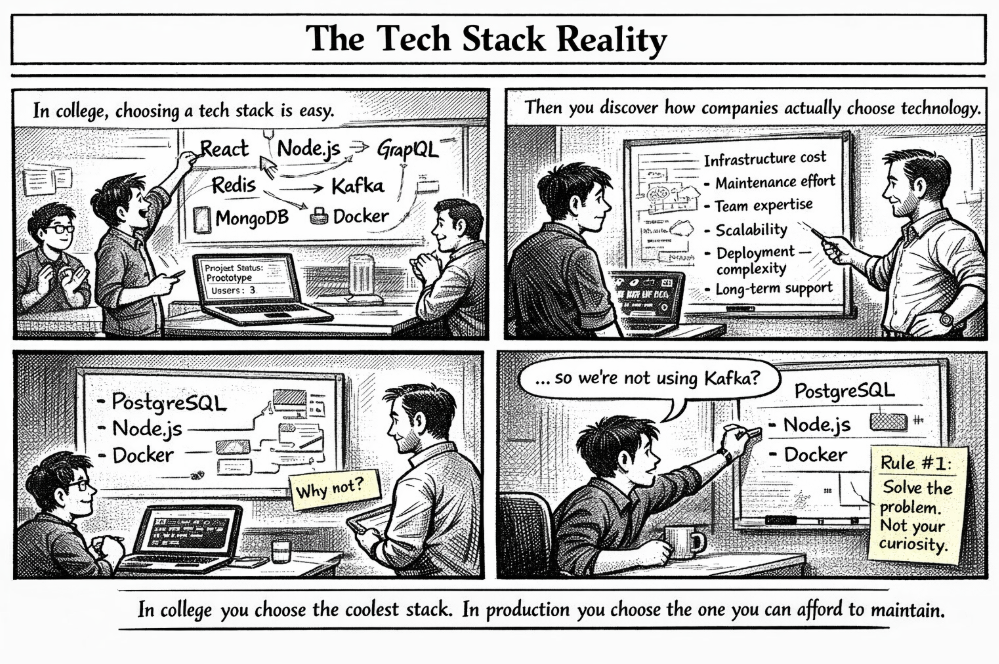

*When your dream stack meets the company budget.*

---

## 🧩 Problem

In college, choosing a tech stack feels like a creative playground.

You gather your teammates and start listing everything exciting:

👉 React  
👉 Node.js  
👉 GraphQL  
👉 Redis  
👉 Kafka  
👉 MongoDB  
👉 Docker  
👉 Kubernetes  

The goal is simple: **build something cool and make it work.**

But once you enter the industry, you quickly discover something important:

> **Technology decisions are not just technical decisions.  
> They are business decisions.**

Companies don't choose stacks based on what is trendy.  
They choose them based on what they can **maintain, scale, and afford**.

---

## 💻 A Simple Example

Imagine building a notification system for an application.

In a college project, you might design something ambitious like this:

```javascript
// Over-engineered student version

import Kafka from "kafka-node";
import Redis from "redis";
import express from "express";

const app = express();
const redisClient = Redis.createClient();

app.post("/notify", (req, res) => {
    const message = req.body.message;

    // Push event to Kafka
    kafkaProducer.send([{ topic: "notifications", messages: message }]);

    // Cache message
    redisClient.set("latest_notification", message);

    res.send("Notification queued");
});

app.listen(3000);
````

It works… but for a small application it might be **overkill**.

A production team might instead start with something much simpler:

```javascript
// Practical production-first approach

import express from "express";

const app = express();

app.post("/notify", (req, res) => {
    const message = req.body.message;

    // Store notification directly in database
    saveNotification(message);

    res.send("Notification saved");
});

app.listen(3000);
```

Why?

Because the simpler system:

* is easier to deploy
* is easier to maintain
* reduces infrastructure cost
* allows faster development

If the system grows later, **more components can always be added**.

---

## 🌍 Real-World Connection

Engineering teams often evaluate technology choices using questions like:

* **Does the team know this technology well?**
* **How much will this cost to run in the cloud?**
* **How hard will it be to maintain next year?**
* **Does this actually solve our problem?**

For example, introducing Kafka into a system means managing:

* message brokers
* partitions
* monitoring clusters
* operational maintenance

If the application only has **a few thousand users**, the complexity might not be justified.

This is why many production systems start simple and **evolve over time**.

---

## 🛠 How Companies Actually Choose Tech

When selecting a stack, engineering teams typically consider:

### **Cost**

Every service in the cloud costs money.

Adding more infrastructure increases:

* server costs
* storage costs
* monitoring costs

---

### **Team Expertise**

A technology is only useful if the team understands it.

Using a complex stack without expertise can lead to:

* bugs
* slow development
* difficult debugging

---

### **Maintenance**

Production systems live for **years**, not weeks.

Every component added today must be maintained tomorrow.

---

### **Scalability**

Good architectures start simple but allow growth.

Instead of over-engineering early, teams often follow the rule:

> **Build for today, design for tomorrow.**

---

## ⚡ Takeaway

One of the biggest lessons interns learn is this:

In college we often ask:

> **“What’s the coolest stack we can build with?”**

In production, engineers ask:

> **“What’s the simplest stack that solves the problem?”**

Because the best architecture isn’t the most complex one.

It’s the one your team can **build, run, and maintain reliably**.

---

🔙 [Back to TheCodeLores Home](../../index.md)

📅 Published: March 2026
✍️ Author: [Aisha Karigar](https://github.com/aishakarigar)
