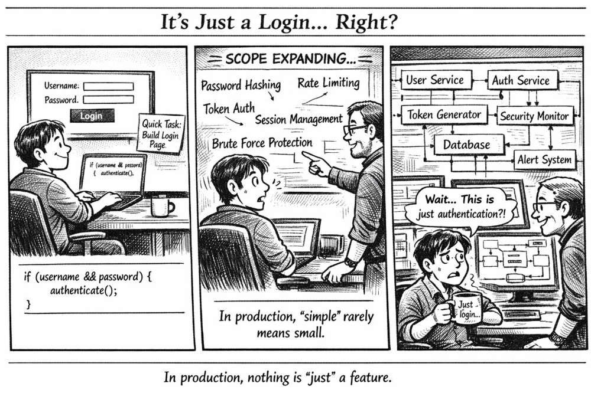

*When a “quick login page” turns into a full security architecture 🔐*

---

## 🧩 Problem  

A login page looks deceptively simple.

All you need is a username, a password, and a button… right?

At first glance, many beginners implement authentication like this:

```cpp
if (username && password) {
    authenticate();
}
````

If both fields exist, call a function to check them.

Simple. Clean. Done.

But in the real world, authentication is **one of the most complex and security-critical parts of a system**.

Because a login page isn't just a form — it's the **front door to your entire platform**.

---

## 💻 Code Example (C++)

Below is a **simplified conceptual authentication flow**.
Real systems use frameworks and secure libraries, but the idea is similar.

```cpp
#include <iostream>
#include <string>
using namespace std;

string hashPassword(const string& password) {
    // Placeholder for a secure hashing algorithm (e.g., bcrypt)
    return "hashed_" + password;
}

bool verifyPassword(const string& input, const string& storedHash) {
    return hashPassword(input) == storedHash;
}

class AuthService {
public:
    bool login(string username, string password) {
        // Simulated database record
        string storedUser = "admin";
        string storedHash = hashPassword("secure123");

        if (username != storedUser) {
            return false;
        }

        if (!verifyPassword(password, storedHash)) {
            return false;
        }

        // In real systems this would generate a session or token
        cout << "Login successful. Session created." << endl;
        return true;
    }
};

int main() {
    AuthService auth;

    auth.login("admin", "secure123");
    auth.login("admin", "wrongpass");

    return 0;
}
```

Even this simplified version hides many critical layers that production systems must handle.

---

## 🌍 Real-World Connection

Major platforms like:

* Google
* GitHub
* Amazon
* Banking apps

treat authentication as a **full security system**, not just a form submission.

When you click **Login**, dozens of things may happen behind the scenes:

* Password hashing verification
* Rate limiting checks
* Session or token creation
* Device fingerprinting
* Suspicious login detection
* Logging and monitoring

All of this happens in **milliseconds** so the user experience still feels instant.

---

## 🛠 What Real Systems Actually Include

A production login system usually requires several components.

### **Password Hashing**

Passwords should **never be stored in plain text**.

Instead they are hashed using algorithms such as:

* bcrypt
* Argon2
* PBKDF2

This ensures even if the database leaks, attackers cannot easily recover passwords.

---

### **Rate Limiting**

Without limits, attackers can attempt **millions of password guesses**.

Systems prevent this by:

* Limiting login attempts per minute
* Temporarily locking accounts
* Blocking suspicious IP addresses

---

### **Session / Token Management**

After login succeeds, the system generates:

* **Session IDs** (traditional web apps)
* **JWT tokens** (modern APIs)

These tokens allow the user to stay logged in without resending credentials every request.

---

### **Monitoring & Alerts**

Security teams track login behavior such as:

* Too many failed attempts
* Logins from unusual locations
* Rapid credential changes

These events can trigger **alerts or automated security actions**.

---

## ⚡ Takeaway

This comic highlights a common lesson in software engineering:

👉 **The simplest features often hide the deepest complexity.**

A login box may look like:

```
Username
Password
Login
```

But behind it sits an entire **security infrastructure** designed to protect users and data.

So the next time someone says:

“It's just a login page.”

Engineers know the truth.

🔥 **Nothing in production is ever “just” a feature.**

---

🔙 [Back to TheCodeLores Home](../../index.md)

📅 Published: September 2025
✍️ Author: [Aisha Karigar](https://github.com/aishakarigar)
