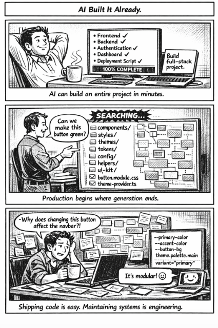

*AI built the app in minutes. Changing one button color took hours 🎨*

---

## 🧩 Problem  

Modern AI tools can generate a **full-stack application in minutes**:

👉 Frontend  
👉 Backend  
👉 Authentication  
👉 Routing  
👉 Deployment setup  

Everything looks production-ready.

Until the manager walks in and says:

“Can we make this button green instead?”

💥 Suddenly, the real debugging begins.

Because generated code ≠ production-understood code.

---

## 💻 Code Example (C++)

Here’s a tiny example that mirrors what often happens inside large generated systems:

A simple button color looks easy…

…but the color might come from multiple abstraction layers.

```cpp
#include <iostream>
#include <string>
using namespace std;

// Simulating layered configuration like real UI frameworks

string getThemeColor() {
    return "blue";
}

string getButtonVariant(string variant) {
    if (variant == "primary")
        return getThemeColor();
    return "gray";
}

int main() {
    string buttonVariant = "primary";

    cout << "Button color is: "
         << getButtonVariant(buttonVariant)
         << endl;

    // Manager request:
    // "Make it green"

    // Where should we change it?
    // getThemeColor() ?
    // getButtonVariant() ?
    // buttonVariant ?
    // global config ?

    return 0;
}
````

Looks simple.

Until the color actually lives in:

* theme config
* UI component props
* environment variables
* shared design tokens
* framework defaults
* or generated wrapper layers

---

## 🌍 Real-World Connection

AI can generate working applications fast.

But production engineering is about **understanding systems**, not just generating them.

Imagine joining a large project where:

* components are auto-generated
* styles are abstracted
* configs are layered
* naming is inconsistent
* documentation is missing

Now someone asks:

“Change one button color.”

Instead of seconds…

it becomes a **codebase treasure hunt**.

This is the difference between:

🧪 Generated code
vs
🏗 Maintained software systems

---

## 🛠 How It’s Solved in the Real World

Production teams don’t just generate code.

They design systems that are **maintainable**.

Here’s how engineers prevent the “button-color problem”:

* **Design Systems**
  Centralized tokens like:

  ```
  primary-color
  secondary-color
  accent-color
  ```

  So UI updates happen in one place.

* **Documentation-first architecture**

  Engineers explain:

  Where styles live
  How components connect
  What overrides what

* **Clear ownership**

  Teams define:

  Who owns UI
  Who owns backend
  Who owns theme configs

* **Refactoring generated code**

  AI output is often treated as a **starting draft**, not the final architecture.

Because maintainability > speed.

Always.

---

## ⚡ Takeaway

AI can generate apps faster than ever.

But production engineering isn’t about generating code.

It’s about **understanding it when change arrives**.

👉 Real software maturity begins the moment someone says:

“Just change the button color.”

---

🔙 [Back to TheCodeLores Home](../../index.md)

📅 Published: March 2026
✍️ Author: [Aisha Karigar](https://github.com/aishakarigar)
