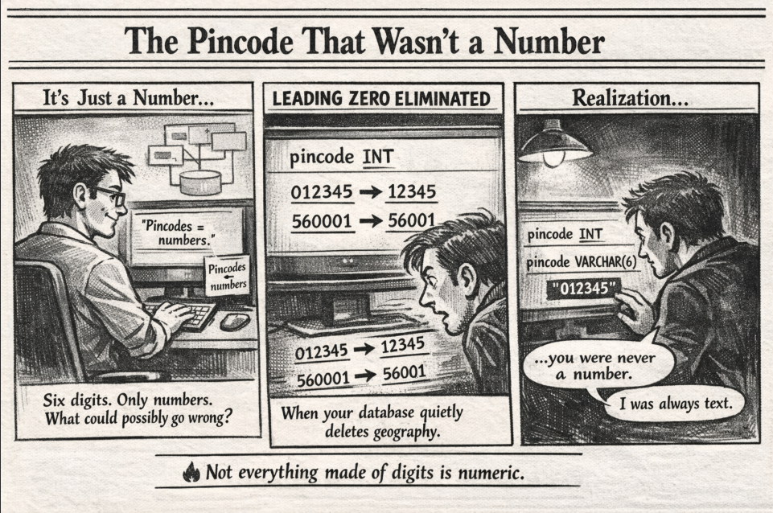

*When six digits pretend to be a number but behave like identity data 📮*

---

## 🧩 Problem

At first glance, a **pincode** looks like a number.

Six digits.
Only numeric characters.
Perfect candidate for `INT` in a database… right?

But here’s the catch:

👉 Pincodes are **identifiers**, not quantities.

So when stored as integers:

```

012345 → 12345

````

💥 Leading zeros disappear.

Suddenly your database silently changes real-world location data.

---

## 💻 Code Example (SQL)

Here’s the classic mistake:

```sql
CREATE TABLE address (
    id INT PRIMARY KEY,
    city VARCHAR(50),
    pincode INT
);
````

Looks harmless.

Until production data arrives:

```
012345 stored as 12345
```

Correct version:

```sql
CREATE TABLE address (
    id INT PRIMARY KEY,
    city VARCHAR(50),
    pincode VARCHAR(6)
);
```

Now:

```
"012345" stays "012345"
```

Exactly as intended ✅

---

## 🌍 Real-World Connection

This isn’t just about pincodes.

Many numeric-looking values are actually **labels**, not numbers:

* Pincodes
* Phone numbers
* Aadhaar numbers
* ZIP codes
* Product IDs
* Employee IDs
* Roll numbers

You never:

* add them
* subtract them
* multiply them
* average them

They exist to **identify**, not calculate.

Which means they belong in:

```
VARCHAR
```

—not—

```
INT
```

---

## 🛠 How It’s Solved in the Real World

Production systems treat identity-style numbers differently from mathematical numbers.

Here’s how engineers handle them correctly:

* **Store identifiers as text**

  Postal codes differ across countries:

  ```
  India: 560001
  USA: 02115
  UK: SW1A 1AA
  ```

  Only text supports all formats safely.

* **Preserve leading zeros**

  Example:

  ```
  02115 ≠ 2115
  ```

  One missing zero = wrong location.

* **Avoid unintended transformations**

  Integer storage can:

  * drop zeros
  * reformat values
  * break indexing logic
  * corrupt imported datasets

* **Design globally compatible schemas**

  Production databases assume:

  identifiers ≠ numbers

  even if they look numeric.

---

## ⚡ Takeaway

Not everything made of digits is numeric.

Some values are meant to be calculated.

Others are meant to be remembered exactly as they are.

👉 Great engineers don’t just store data.

They store **meaning**.

---

🔙 [Back to TheCodeLores Home](../../index.md)

📅 Published: April 2026
✍️ Author: [Aisha Karigar](https://github.com/aishakarigar)
